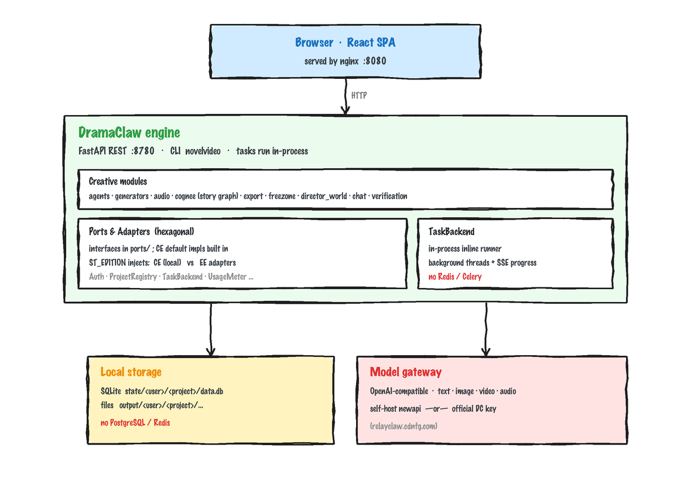
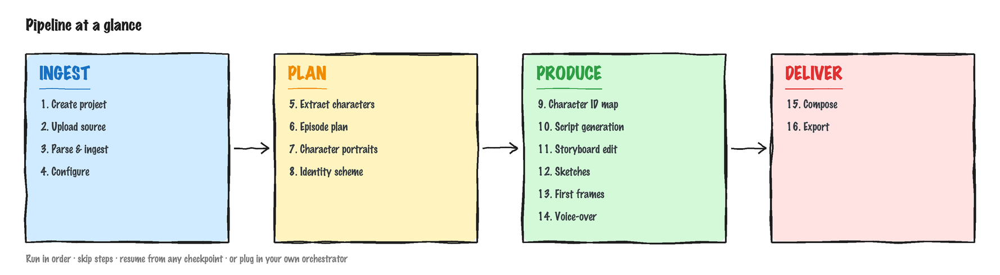

<!-- lang-switch -->
[English](../../en/concepts/architecture.md) · **简体中文**

# 架构

DramaClaw 社区版（CE）是一条**单机运行**的「小说 → 成片」流水线：一个 FastAPI 服务承载全部创作能力，任务在进程内执行，数据落本地，模型经一个 OpenAI 兼容网关接入。**无需 PostgreSQL / Redis。**

## 系统架构

  

## 处理流程

  

每一阶段都有独立接口，可顺序跑、跳步跑、从任意检查点续跑。

## 代码结构

`src/novelvideo/` 主要子包：

| 包 | 职责 |
|---|---|
| `api` | 项目作用域的 REST 路由 |
| `agents` | 剧本 / 资产 / 身份 / 规划等智能体 |
| `generators` | 图片 / 视频 / 音频生成适配器 |
| `audio` | 配音（TTS）合成 |
| `cognee` | 故事知识图谱（解析小说，构建角色 / 关系 / 时间线） |
| `freezone` | 自由创作画布 |
| `director_world` | 3DGS / world 场景特性 |
| `chat` | 对话式创作助手 |
| `export` | 剧集合成与成片导出 |
| `verification` | 校验与审校工具 |
| `task_backend` | 任务调度与 runner（CE 进程内执行） |
| `storage` / `sqlite_store` | 本地存储 |
| `ports` | 端口与适配器层（见下） |
| `prompts` / `styles` | 基线提示词与风格 |

## 端口与适配器（一套代码，两个发行物）

DramaClaw 用 **Ports & Adapters（六边形架构）** 把「引擎」与「运行环境」解耦。`src/novelvideo/ports/` 定义一组 Protocol 接口，每个接口都有 **CE 默认实现**（单机 / 本地）；商业企业版（EE）为**同一组接口**提供企业适配器（多租户 / 分布式）。

铁律：**核心代码永不 import 企业代码**；运行时按 `ST_EDITION` 注入对应实现。CE 默认实现自带，开箱即用。

| 端口 | CE 默认 | 企业版适配器 |
|---|---|---|
| Auth | 本地单用户、免登录 | 多租户认证 |
| ProjectRegistry | 本地 SQLite 索引 | 机群登记 / 路由 |
| ProjectAccess | owner-everywhere | 租户 RBAC |
| TaskBackend | 进程内 inline | Celery 分布式 |
| CancellationStore | 进程内 | Redis |
| UsageMeter | no-op | 计量计费 |
| Lifecycle | no-op | PG 池 / Redis |
| AuditSink | 本地 NDJSON | 审计表 |
| CreditQuote | cost = 0 | 价格表 |

> 端口定义、注册表与 CE 默认实现都住在核心侧；EE 只提供实现 + 启动时注册。这让「同一套代码、社区与商业不分叉」得以成立。

## 任务执行

CE 的 TaskBackend = **进程内 inline**（后台线程 + EventSource 进度流）：断点续跑、可取消，但**不需要 Redis / Celery**。任务中心的进度 / 取消体验与企业版一致。

## 数据与存储

CE 固定**单本地用户**，项目数据全部在本地：

- `state/<user>/<project>/data.db`（SQLite）—— 项目结构化数据
- `output/<user>/<project>/...` —— 成片与素材

不依赖任何外部数据库。

## 模型接入

所有文本 / 图片 / 视频 / 音频模型经一个 **OpenAI 兼容网关**接入（自带网关或官方 key），详见[配置模型供应商](../getting-started/configuring-models.md)。

## 技术栈

Python + FastAPI（REST API，`:8780`）· CLI `novelvideo` · React 前端 · Docker Compose 自托管。
